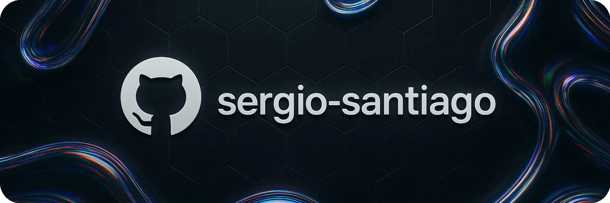

  

---

### Senior Backend Engineer from Spain 🇪🇸  
#### Distributed Systems · Cloud & Container Platforms · AI-Augmented Development  

> 🏗 Crafting scalable, maintainable, and performant systems with  
> **Hexagonal Architecture · DDD · CQRS**  

_💬 › Let's talk about building better software._  

---

### 🚀 Working on [**Secture Labs**](https://github.com/secture)

---

### 🛠 Tech Stack

| 🧰 Languages                                                                                                                                                                                                                                                                                                                                                                                                                                                                                    | 🔧 Frameworks                                                                                                                                                                                                                                                                                                                                                                                                                                                                                                     | ⚙️ Infra & Observability                                                                                                                                                                                                                                                                                                                                                                                                                              |
|-------------------------------------------------------------------------------------------------------------------------------------------------------------------------------------------------------------------------------------------------------------------------------------------------------------------------------------------------------------------------------------------------------------------------------------------------------------------------------------------------|-------------------------------------------------------------------------------------------------------------------------------------------------------------------------------------------------------------------------------------------------------------------------------------------------------------------------------------------------------------------------------------------------------------------------------------------------------------------------------------------------------------------|-------------------------------------------------------------------------------------------------------------------------------------------------------------------------------------------------------------------------------------------------------------------------------------------------------------------------------------------------------------------------------------------------------------------------------------------------------|
|        |        | ![AWS](https://img.shields.io/badge/-AWS-232F3E?logo=)       |

---

  
<b>📊 Top Languages in Public Projects</b>

   
  

    
  

  📌 Stats are based only on public repositories. Private and professional work are not reflected.

---

### 🌐 Connect with me

[![LinkedIn](https://img.shields.io/badge/-sergio--santiago-0A66C2?style=flat&logo=)](https://www.linkedin.com/in/sergio-santiago)&nbsp;
&nbsp;

---

> **Do not try and bend the spoon. That's impossible. Instead, only try to realize the truth… There is no spoon.** — *The Matrix*  

Understanding the problem is often more powerful than trying to force the solution.
