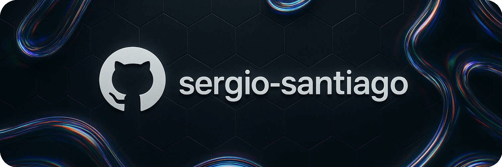

  

---

### Senior Backend Engineer from Spain 🇪🇸
#### Distributed Systems & High Traffic · Payments · Architecture (Hexagonal · DDD · CQRS)

> 💳 I work on the hard problems of money at scale: payments, distributed systems
> and concurrency under load.

_💬 › Let's talk about building better software._

---

   

---

### 🚀 Working on [**Secture Labs**](https://github.com/secture)

---

### 🛠 Tech Stack

| 🧩 Architecture & Practices | 🧰 Languages | 🔧 Frameworks | 🗄 Data & Messaging | ⚙️ Cloud, Infra & Observability |
|---|---|---|---|---|
|         |       |        |        |          |

---

  
<b>📊 Top Languages in Public Projects</b>

   
  

    
  

  📌 Stats are based only on public repositories. Private and professional work are not reflected.

---

### 🌐 Connect with me

&nbsp;
&nbsp;

---

> **Do not try and bend the spoon. That's impossible. Instead, only try to realize the truth… There is no spoon.** — *The Matrix*

Understanding the problem is often more powerful than trying to force the solution.
