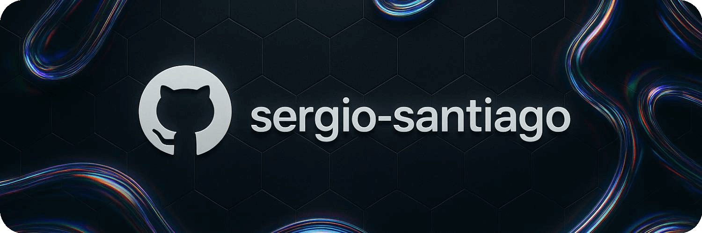

  

---

## 👋 Hi, I'm Sergio Santiago Henares  
Backend Engineer from Spain 🇪🇸  

> 🏗 Crafting scalable, maintainable, and performant systems with  
> **Hexagonal Architecture · DDD · CQRS**  

_💬 › Let's talk about building better software._  

---

### 🚀 Working on [**Secture Labs**](https://github.com/secture)

---

### 🛠 Tech Stack

| 🧰 Languages | 🔧 Frameworks | ⚙️ Infra & Observability |
|--------------|---------------|--------------------------|
|       |       |      |

---

  
<b>📊 Top Languages in Public Projects</b>

   
  

    
  

  📌 Stats are based only on public repositories. Private and professional work are not reflected.

---

### 🌐 Connect with me

[![LinkedIn](https://img.shields.io/badge/-sergio--santiago-0A66C2?style=flat&logo=data:image/svg+xml;base64,PHN2ZyBoZWlnaHQ9IjgwMHB4IiB3aWR0aD0iODAwcHgiIHZlcnNpb249IjEuMSIgaWQ9IkxheWVyXzEiIHhtbG5zPSJodHRwOi8vd3d3LnczLm9yZy8yMDAwL3N2ZyIgeG1sbnM6eGxpbms9Imh0dHA6Ly93d3cudzMub3JnLzE5OTkveGxpbmsiIHZpZXdCb3g9IjAgMCAzODIgMzgyIiB4bWw6c3BhY2U9InByZXNlcnZlIj48cGF0aCBzdHlsZT0iZmlsbDojZmZmZmZmOyIgZD0iTTM0Ny40NDUsMEgzNC41NTVDMTUuNDcxLDAsMCwxNS40NzEsMCwzNC41NTV2MzEyLjg4OUMwLDM2Ni41MjksMTUuNDcxLDM4MiwzNC41NTUsMzgyaDMxMi44ODljMTkuMDg0LDAsMzQuNTU1LTE1LjQ3MSwzNC41NTUtMzQuNTU2VjM0LjU1NUMzODIsMTUuNDcxLDM2Ni41MjksMCwzNDcuNDQ1LDB6IE0xMTguMjA3LDMyOS44NDRjMCw1LjU1NC00LjUwMiwxMC4wNTYtMTAuMDU2LDEwLjA1Nkg2NS4zNDVjLTUuNTU0LDAtMTAuMDU2LTQuNTAyLTEwLjA1Ni0xMC4wNTZWMTUwLjQwM2MwLTUuNTU0LDQuNTAyLTEwLjA1NiwxMC4wNTYtMTAuMDU2aDQyLjgwNmM1LjU1NCwwLDEwLjA1Niw0LjUwMiwxMC4wNTYsMTAuMDU2VjMyOS44NDR6IE04Ni43NDgsMTIzLjQzMmMtMjIuNDU5LDAtNDAuNjY2LTE4LjIwNy00MC42NjYtNDAuNjY2UzY0LjI4OSw0Mi4xLDg2Ljc0OCw0Mi4xczQwLjY2NiwxOC4yMDcsNDAuNjY2LDQwLjY2NlMxMDkuMjA4LDEyMy40MzIsODYuNzQ4LDEyMy40MzJ6IE0zNDEuOTEsMzMwLjY1NGMwLDUuMTA2LTQuMTQsOS4yNDYtOS4yNDYsOS4yNDZIMjg2LjczYy01LjEwNiwwLTkuMjQ2LTQuMTQtOS4yNDYtOS4yNDZ2LTg0LjE2OGMwLTEyLjU1NiwzLjY4My01NS4wMjEtMzIuODEzLTU1LjAyMWMtMjguMzA5LDAtMzQuMDUxLDI5LjA2Ni0zNS4yMDQsNDIuMTF2OTcuMDc5YzAsNS4xMDYtNC4xMzksOS4yNDYtOS4yNDYsOS4yNDZoLTQ0LjQyNmMtNS4xMDYsMC05LjI0Ni00LjE0LTkuMjQ2LTkuMjQ2VjE0OS41OTNjMC01LjEwNiw0LjE0LTkuMjQ2LDkuMjQ2LTkuMjQ2aDQ0LjQyNmM1LjEwNiwwLDkuMjQ2LDQuMTQsOS4yNDYsOS4yNDZ2MTUuNjU1YzEwLjQ5Ny0xNS43NTMsMjYuMDk3LTI3LjkxMiw1OS4zMTItMjcuOTEyYzczLjU1MiwwLDczLjEzMSw2OC43MTYsNzMuMTMxLDEwNi40NzJMMzQxLjkxLDMzMC42NTRMMzQxLjkxLDMzMC42NTR6Ii8+PC9zdmc+)](https://www.linkedin.com/in/sergio-santiago)&nbsp;
&nbsp;

---

> **Do not try and bend the spoon. That's impossible. Instead, only try to realize the truth… There is no spoon.** — *The Matrix*  

Understanding the problem is often more powerful than trying to force the solution.
